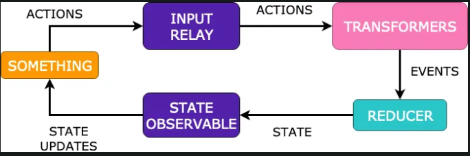

# APP TASK LIST
# Qué es este proyecto?
Una App para crear tareas con dos sesiones completas y pendientes.,

Proyecto

# Características principales
1. Kotlin
2. Arquitectura MVI -  (Model-View-Intent)
3. Jetpack Compose - UI
4. MutableStateOf -  herramienta fundamental para administrar el estado y activar actualizaciones de la interfaz de usuario.
5. UIEvent - Son el puente entre la interacción del usuario y la lógica de la aplicación, proporcionando una forma clara y concisa de representar las acciones del usuario al sistema.
6. Realm - Realm es una base de datos móvil que se ejecuta directamente en teléfonos, tabletas o dispositivos portátiles. Este repositorio contiene el código fuente de la versión Java de Realm, que actualmente solo se ejecuta en Android.
7. Koin - Injeccionde dependencia
8. Navigation Compose - grafo de navegacion en la UI
9. Corrutinas - son una característica de Kotlin que permite escribir código asíncrono de manera más concisa y legible.
10. Coil - Gestion de carga de imagenes
11. ArrowKt - Arrow comprende diferentes bibliotecas, cada una de las cuales mejora o amplía una biblioteca de uso común en el ecosistema de Kotlin o una característica particular del lenguaje Kotlin.
12. OrbitMVI -  - 
    Construido sobre RxJava para minimizar la cantidad de código personalizado
    DSL fácil de seguir para MVI, comience con solo unas pocas líneas de código
    Diseñado para Android, ¡pero también puede ejecutarse sin ninguna interfaz de usuario!
    Threading predecible y cancelación automática de suscripción
# Funciones de composición

4. Fonts
5. Colors
    - creating
7. ConstraintLayout
8. Rows
9. Columns
10. Scaffold
11. AppBar
12. Circular Progress Indicator

# Pruebas
1. Junit
1. Mockito

#  Flow?
1. Flow
    1. Flow es genial. es una característica de Kotlin coroutines que proporciona una forma asincrónica y reactiva de trabajar con secuencias de datos.
       El método getListRecipeUseCase devuelve un Flow ya que se realiza una operación collect en el resultado. Esto indica que probablemente getListRecipeUseCase retorna un flujo de datos asincrónico que el ViewModel está consumiendo.
       1.(https://kotlin.github.io/kotlinx.coroutines/kotlinx-coroutines-core/kotlinx.coroutines.flow/).
1. StateFlow Semántica de Estado:
    1. StateFlow  está diseñado específicamente para representar un estado mutable y proporcionar un flujo de eventos que notifica a los suscriptores cuando el estado cambia. Esto es útil cuando necesitas mantener y compartir un estado mutable en toda tu aplicación. (https://developer.android.com/reference/kotlin/androidx/compose/runtime/MutableState) in viewmodels.
1. StateFlow Semántica de Estado:
    1. SharedFlow  está diseñado para emitir eventos o notificaciones a sus suscriptores. Es adecuado cuando necesitas comunicar eventos que no necesariamente están relacionados con un estado mutable. (https://developer.android.com/reference/kotlin/androidx/compose/runtime/MutableState) in viewmodels.

# References
1. https://github.com/realm/realm-java
1. https://github.com/orbit-mvi/orbit-mvi
2. https://github.com/babylonhealth/orbit-mvi/blob/main/readme-old.md
1. https://old.arrow-kt.io/docs/core/
1. https://developer.android.com/jetpack/compose/state
2. https://medium.com/@VolodymyrSch/android-simple-mvi-implementation-with-jetpack-compose-5ee5d6fc4908